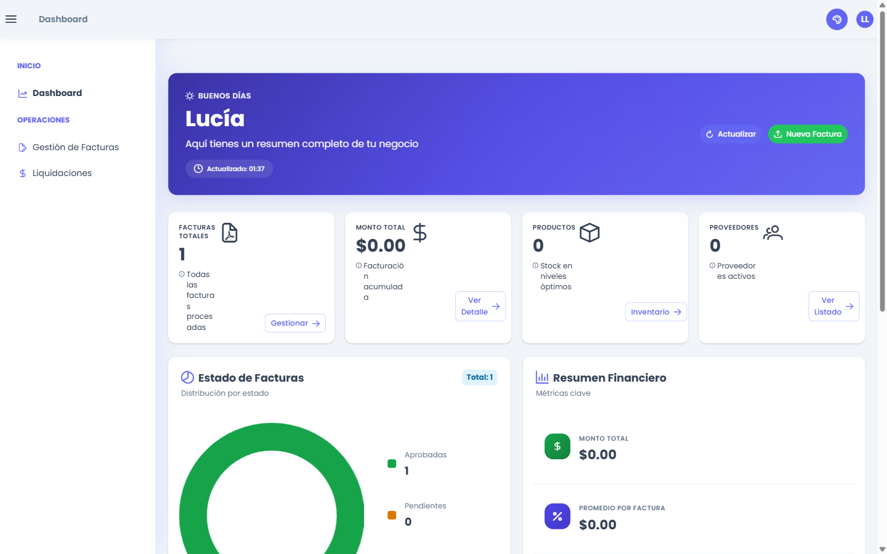
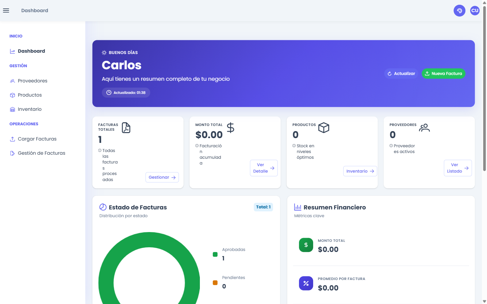

# Evidencias — Control de acceso por rol (RBAC)

**Proyecto:** Invoice Process — GR05 *Gestión inteligente de facturas*
**Módulo:** Gestión de personas, usuarios y roles (control de acceso)
**Fecha:** 2026-06-18

## 1. Resumen

Cada rol ve únicamente las pestañas que le corresponden. El **backend es la fuente de verdad**:
define la matriz de permisos, la entrega en el login y **hace cumplir** el acceso a los endpoints con
`RolesGuard` + `@Roles`. El **frontend la refleja**: filtra el menú lateral y bloquea la navegación por
URL con un `RoleGuard`.

Roles: `admin`, `manager`, `user`, `viewer`.

## 2. Matriz rol → pestaña (fuente de verdad)

| Pestaña / permiso | admin | manager | user | viewer |
|---|:--:|:--:|:--:|:--:|
| Dashboard (`dashboard`) | ✅ | ✅ | ✅ | ✅ |
| Proveedores (`providers`) | ✅ | ✅ | ✅ | — |
| Productos (`products`) | ✅ | ✅ | ✅ | — |
| Categorías (`categories`) | ✅ | ✅ | — | — |
| Inventario (`inventory`) | ✅ | ✅ | ✅ | — |
| Cargar Facturas (`invoices.upload`) | ✅ | ✅ | ✅ | — |
| Gestión de Facturas (`invoices.manage`) | ✅ | ✅ | ✅ | ✅ |
| Liquidaciones (`settlements`) | ✅ | ✅ | — | ✅ |
| Administración / Usuarios (`admin.users`) | ✅ | — | — | — |

> La matriz vive en un solo lugar del backend: `invoice-process-back-end/src/common/rbac/role-permissions.ts`.

## 3. Arquitectura (dos capas)

- **Backend (enforcement real):** `ROLE_PERMISSIONS` + `permissionsForRole()`; el login/`getMe`/`profile`
  devuelven `user.permissions`; cada controlador protegido con `@UseGuards(AuthGuard('jwt'), RolesGuard)`
  + `@Roles(...)`. Lectura para `viewer` en facturas/liquidaciones; **eliminar facturas es solo `admin`**.
- **Frontend (refleja):** el menú (`app.menu.ts`) filtra por `permissions`; `RoleGuard` redirige a
  `/dashboard` si se intenta entrar por URL a una ruta sin permiso.

## 4. Evidencia — Enforcement de la API (códigos HTTP por rol)

Backend real (`localhost:3000/api`), login por rol y peticiones `GET` (✅ = 200, 🚫 = 403):

| Endpoint | viewer | user | manager |
|---|:--:|:--:|:--:|
| `/api/suppliers` | 🚫 403 | ✅ 200 | ✅ 200 |
| `/api/products` | 🚫 403 | ✅ 200 | ✅ 200 |
| `/api/categories` | 🚫 403 | 🚫 403 | ✅ 200 |
| `/api/inventory-movements` | 🚫 403 | ✅ 200 | ✅ 200 |
| `/api/invoices` | ✅ 200 | ✅ 200 | ✅ 200 |
| `/api/settlements` | ✅ 200 | 🚫 403 | ✅ 200 |
| `/api/suppliers` *(sin token)* | — | — | **401** |

**Granularidad por método (probado):**
- `viewer` `POST /api/settlements` → **403** (lee liquidaciones, no escribe).
- `user` y `manager` `DELETE /api/invoices/:id` → **403** (borrar facturas = solo admin).
- `user` `POST /api/invoices/validate-and-save` → 404 y `manager` `POST /api/settlements` → 400
  (NO 403 → el guard dejó pasar al rol; respondió la lógica de la app).

## 5. Evidencia — Menú filtrado en la GUI (navegador real)

### 5.1 Viewer — solo Dashboard, Gestión de Facturas y Liquidaciones

### 5.2 User — sin Categorías ni Liquidaciones

### 5.3 Manager — menú operativo completo

> **RoleGuard:** como `viewer`, navegar por URL a `/products` redirige automáticamente a `/dashboard`
> (no solo se oculta el item del menú: la ruta queda bloqueada).

## 6. Pruebas automatizadas

- **Backend (Jest):** 21/21 — `permissionsForRole`, `RolesGuard`, `ProductsService`, `AuthService` (login + getMe con permisos).
- **Frontend (Karma/Jasmine):** 34/34 — filtro de menú, `RoleGuard`, servicios y pipe.

## 7. Usuarios de prueba (para reproducir)

Contraseña común: **`Test1234`**

| Rol | Email |
|---|---|
| manager | `manager@test.com` |
| user | `user@test.com` |
| viewer | `viewer@test.com` |

> Se crean con `npm run seed:test-users` (en `invoice-process-back-end`). El rol `admin` usa la cuenta de administrador existente.
